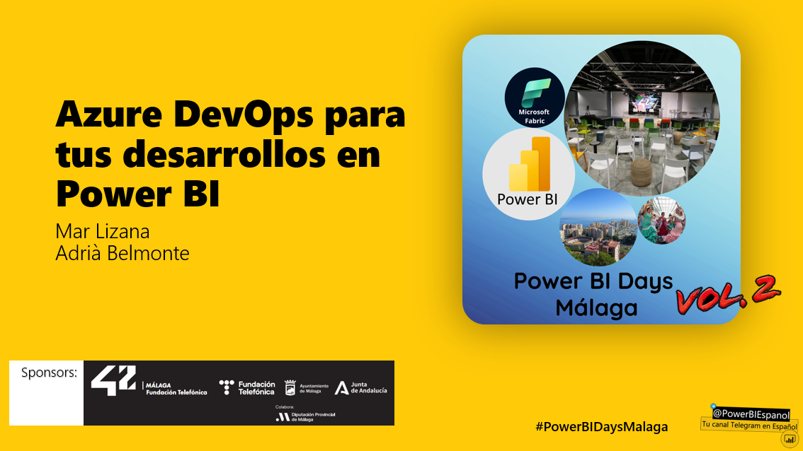

# PowerBIDaysMalaga2024

¡Bienvenido al repositorio de archivos presentados en la charla **Azure DevOps para tus desarollos en PowerBI en PowerBIDays Málaga 2024!** Encuentras aquí los principales recursos de nuestra charla, incluyendo la presentación principal.

## Contenido

- **Presentación**: Revisa de nuevo la ppt presentada en la charla.

- **Pipelines**: Revisa y prueba el código utilizada en las pipelines presentadas.

## Puntos Clave de la Presentación

- Introducción a Power BI y sus capacidades.
- Mejores prácticas para la creación de informes y visualizaciones.

## Links de Información Adicional

- [Tabular Editor](https://docs.tabulareditor.com/?tabs=TE3)
- [PBI-Tools](https://pbi.tools/)
- [PBI-Inspector](https://github.com/NatVanG/PBI-Inspector)
- [¿Qué es Git?](https://learn.microsoft.com/es-es/devops/develop/git/what-is-git)
- [¿Qué es ADO?](https://learn.microsoft.com/es-es/azure/devops/user-guide/what-is-azure-devops?view=azure-devops)
- [¿Qué es Azure Pipelines?](https://learn.microsoft.com/es-es/azure/devops/pipelines/get-started/what-is-azure-pipelines?view=azure-devops)

¡Explora, aprende y empodérate con PowerBIDays Málaga!
